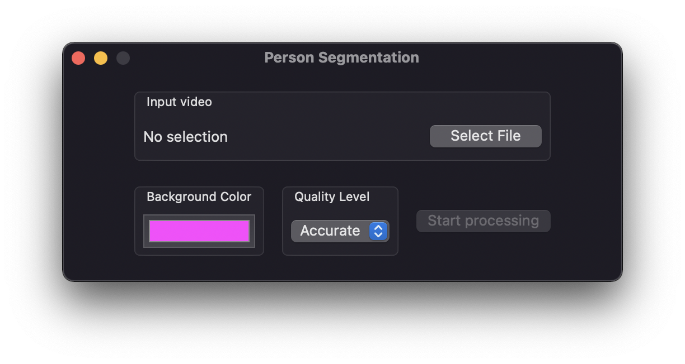
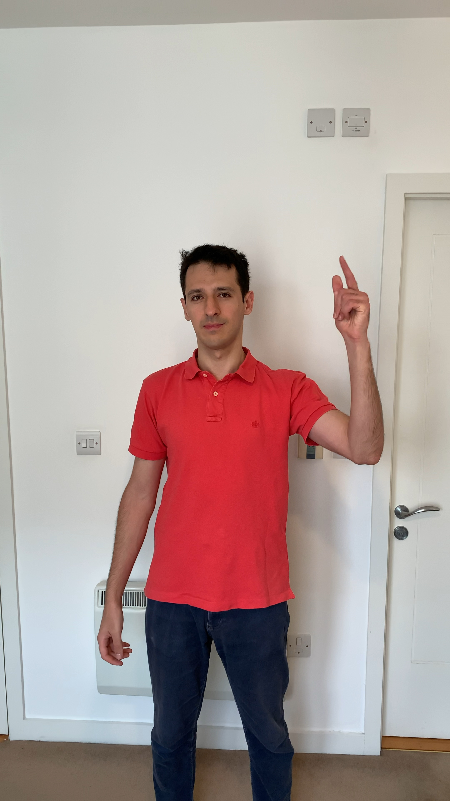
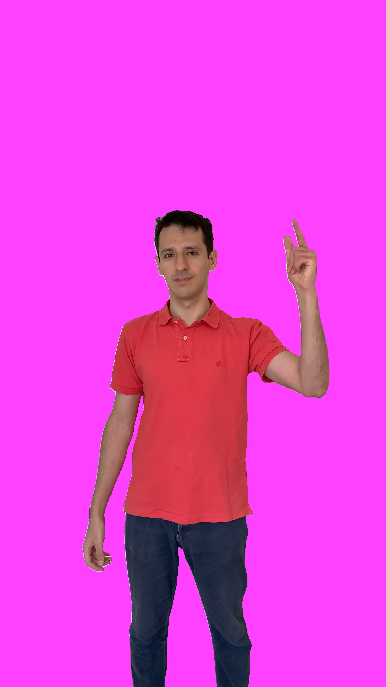

# Person Segmentation for MacOS

Simple macOS app that applies Apple's Person Segmentation algorithm to a video.

The output is always saved to `~/Movies`.

## Example

| Input | Output (Quality Level: Balanced) |
|-------|----------------------------------|
|  |  |

## Requirements

- Xcode 13.1
- macOS Monterey 12.0
- Mac with Apple silicon

This app is just a prototype and it was only tested on a MacBookPro 2021 (M1 Max, 64 GB).
